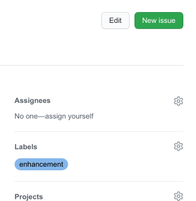

# Day 4

## Practical

Today, you will work on:
1. Make a final decision of the visualisation type
1. Answering your research question with the API
1. Integrate a SPARQL query from Wikidata
1. Ask feedback from the teachers

## Asking feedback

You can request feedback from the authors by filing that request as in "issue" and assigning that issue to
one or more people (with an GitHub account). The GitHub accounts of the teachers can be found in the main
[README](README.md).
[This document](https://docs.github.com/en/free-pro-team@latest/github/managing-your-work-on-github/creating-an-issue)
provides general information on how to create an issue. It also discusses templates, but your repository
will only have that when your group created them.

## Assigning issues

Before you can assign an issue to someone, this person must have accepted your invitation to this person
to join your repository (this is to prevent spamming people). This support page explains [how to invite
people](https://help.github.jp/enterprise/2.11/user/articles/inviting-collaborators-to-a-personal-repository/).

Make sure to "assign" the issue to all teachers. This is done in the issue on the right side, by making
the person you want to reply to the issue an "assignee":

This way of asking feedback does not replace asking questions during the practical, but work well of
asking question outside the practicals, or discuss questions for which there is no immediate answer
and the teacher needs to look up or invent the answer.
