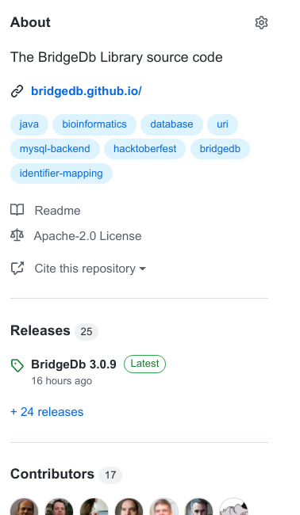
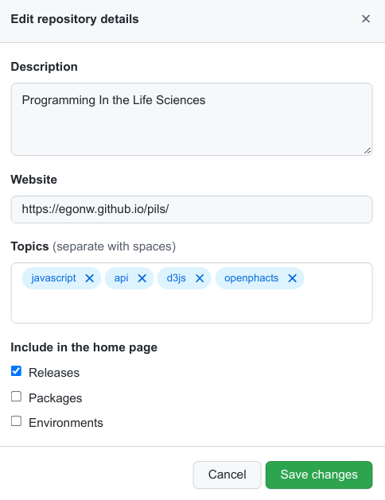
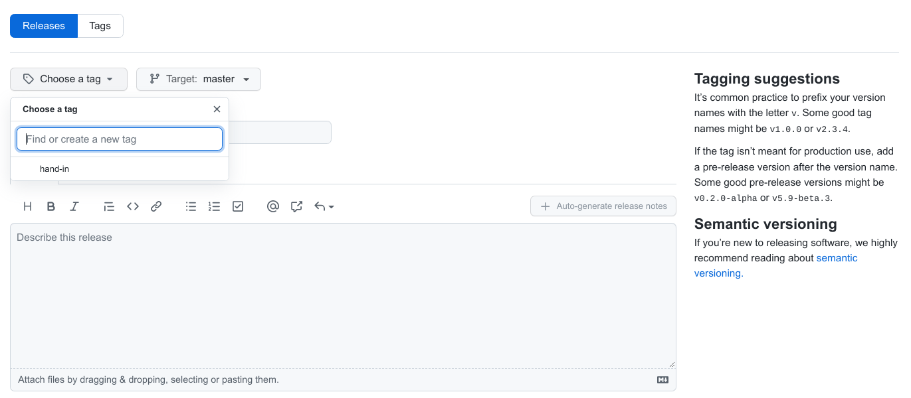
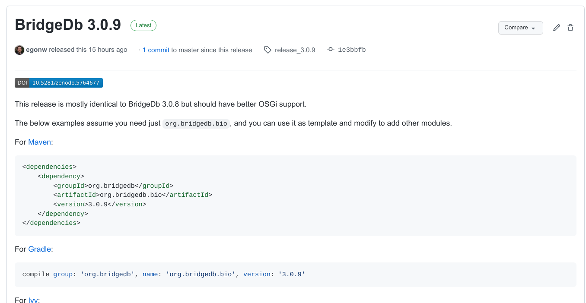

# The Final Product

Software is not complete without a release, whether it is open or closed. The code is also relatively clean,
which helps later users (which includes your future self). The follow checks are meant to reflect good practices
of scientific coding. See the [course literature list](https://github.com/egonw/pils/blob/master/index.md#literature).

Make sure that the teachers have access to your code repository:

 - [ ] teachers have been given access

## 1. Final checking

Make sure your GitHub repo contains these files:

 - [ ] AUTHORS, with everyone who contributed to this repository (in a significant way)
 - [ ] LICENSE, where you indicate under which conditions other can reuse (extend, fix, etc) your code
 - [ ] README, with instructions how to run the code, optionally citing libraries, etc

The `README` can be written as plain text (with `.txt` file extension) or as [Markdown](https://www.markdownguide.org/getting-started)
(with the `.md` file extension) which is easier to read. 

 - [ ] old redundant and temporary test files have been removed
 - [ ] there is a logical folder structure

## 2. Making the release

### 2a. make a release on your GitHub project page

The first step is to make a release in your GitHub project.

The section for releases can be found on the right side, in the _About_ section:

When this is missing, you can add it by clickthing the cogwheel in the top right of this section
and enable it with the checkbox:

Click on releases or just add `/releases` to the the URL of your GitHub project, and click
the _Draft new release_ button, which will give you this screen:

Fill out the form: create a tag (e.g. `release-1`), give it a title, and add a short description (optional).
Finalize the release by publishing it. The result should look something like this (for one of
our department's research projects):

GitHub will automatically create two _assets_, which are identical archives of the respository but just
in two different archive formats (`.tar.gz` and `.zip`).

### 2b. download a copy of the release

From the _assests_ created automatically with the release, download either a `.zip` or a `.tar.gz`.
This file is what you upload in the assignment on Canvas, under Assignments.

On Canvas, in the comments, you must leave the URL to the release page.
