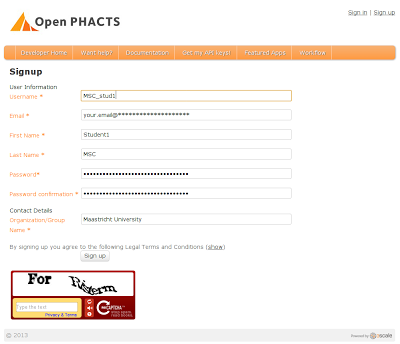
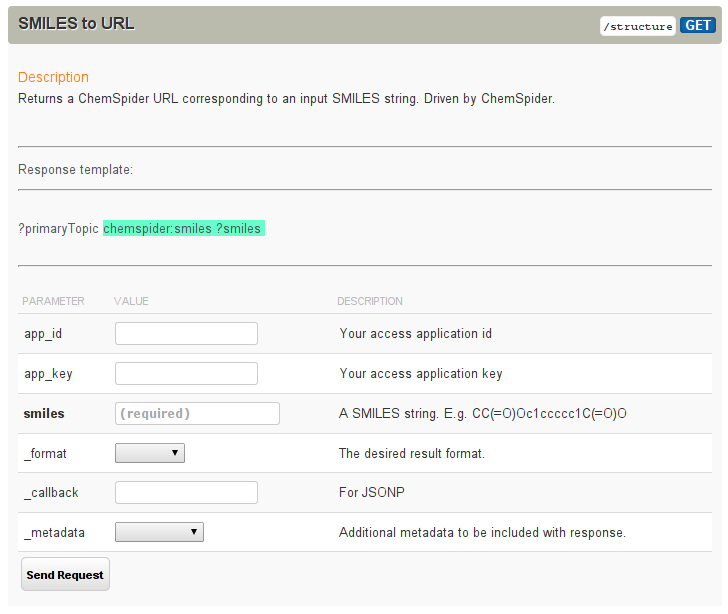
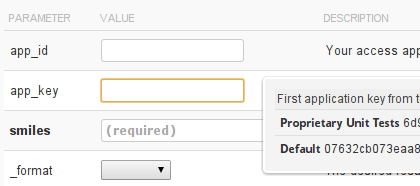

Getting a Open PHACTS API Key
=============================

I have outlined the scope of the six-day course: the students will learn to program while hacking on the
Open PHACTS' Linked Data API (LDA). The first step is to get an account for the LDA. I have already
done that to save time. But these are the steps to take. You go to https://dev.openphacts.org/signup:

You then approve the account via your email account and you are set. The account is needed to get an
API key. Using this key, Open PHACTS developers can contact you if your scripts go berserk. So, you are
kindly invited to make crazy hypotheses and hack the hell out of the platform. That's what I hope my
students will do.

To try your new key, go to the documentation page, and open, for example, the SMILES to URL method:

Here you can see what parameters this LDA method has. We focus now on the app_id and app_key fields.
Each account comes by default with a, um, default app_id and default app_key. Just click on the field
and select them:

Select the defaults and enter a SMILES (try: CC(=O)NC1=CC=C(C=C1)O)). You can select the format you
like (I like Turtle) and you get Linked Data back on this compound.

